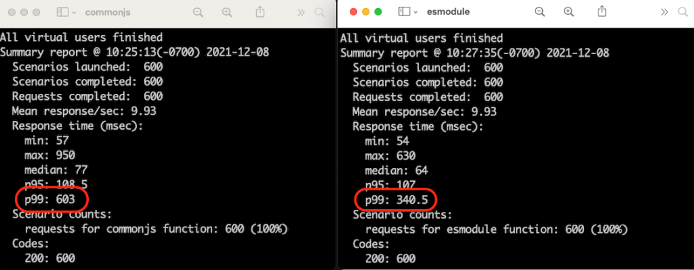

# 🚀 Top-level await in AWS Lamba with TypeScript

This repository demonstrates [Node.js ES modules and top-level await in AWS Lambda](https://aws.amazon.com/blogs/compute/using-node-js-es-modules-and-top-level-await-in-aws-lambda/) while developing your code in TypeScript.

### How does that work?

We use [serverless-esbuild](https://github.com/floydspace/serverless-esbuild) to transpile our TypeScript code to JavaScript.

The secret sauce is to configure esbuild to output Node.js ES modules files with `.mjs` extension.

The combine of the following esbuild options:

```yaml
format: "esm"
outputFileExtension: ".mjs"
platform: "node"
target: "esnext"
```

With that in place, you can have a fully typed AWS Lambda code in TypeScript and take advantage of executing `await` outside the handler function, improving the response time for your consumers.


